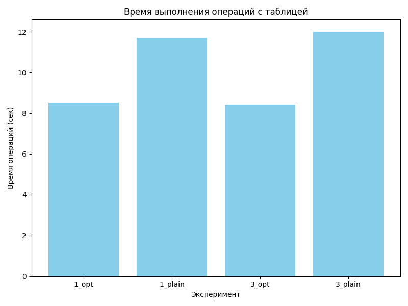
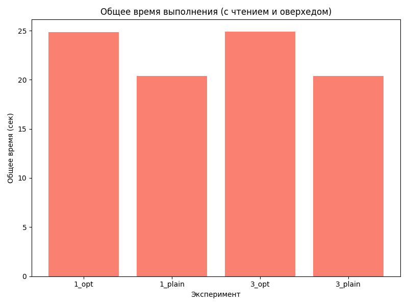
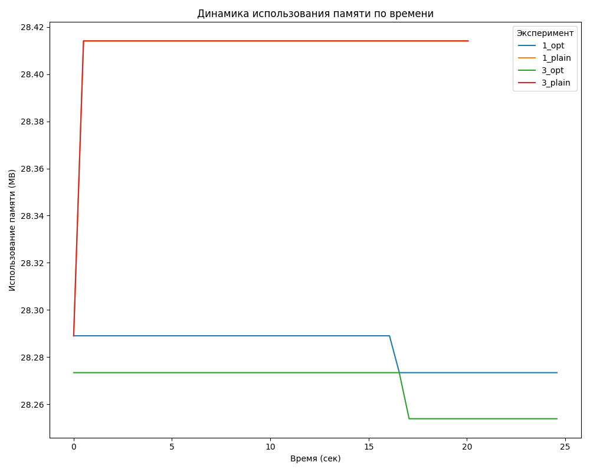
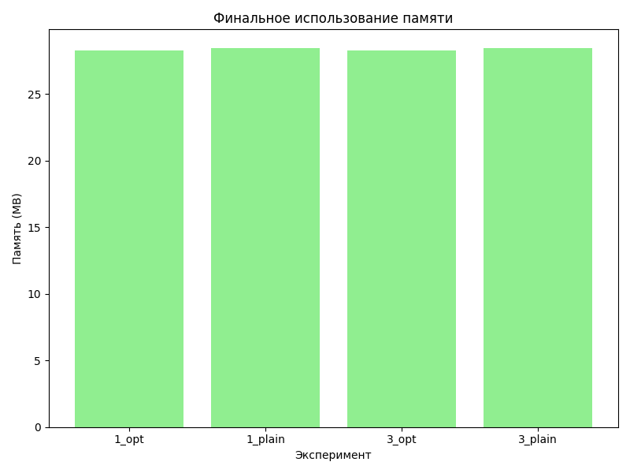

# Experiments with Hadoop and Spark in Docker

This project aims to measure the execution time and memory usage of a Spark application in two cluster configurations.

## Run project

1. Create virtual environment
    ```bash
    python3.10 -m venv venv
    source ./venv/bin/activate
    ```
2. Install required dependencies
    ```bash
    pip install -r requirements.txt
    ```
3. Download dataset from [Google Drive](https://drive.google.com/file/d/1r5NaERzCJXFg14J2Dvnyk4dwdY11Nikn/view?usp=sharing).

4. Run project
    ```
   bash run_experiments.sh
    ```
   * Sets up a cluster with 1 DataNode, loads the dataset into HDFS, and runs the Spark application (with and without optimizations)

   * Stops the cluster

   * Sets up a cluster with 3 DataNodes and repeats the experiments

5. To make visualization run the following script
   ```bash
   python visualize_results.py
   ```
   > Image will be put to the `output` directory.

## Demonstration of the results

The charts show that optimizations have significantly sped up table operations due to overhead at the beginning.





